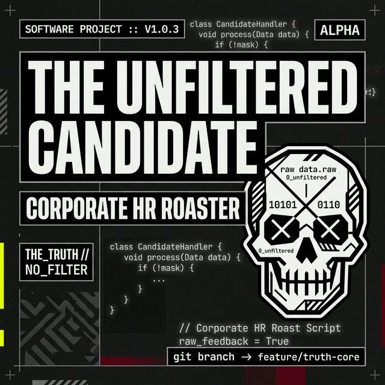

# 💀 The Unfiltered Candidate (Frontend)



[](https://reactjs.org/)
[](https://github.com/jithin-jz)
[](./LICENSE)

**The Unfiltered Candidate** is the frontend for the AI-powered HR interview roaster. Built with a Neo-Brutalist aesthetic, it provides a high-contrast, professional yet rebellious UI for getting brutally honest feedback on those corporate-speak interview questions.

---

## 🔥 Key Features

- **💀 Brutal Roasts UI**: Sharp, minimal, and reactive interface for roasting statements.
- **🇮🇳 Bilingual Interface**: Full support for English and Malayalam sarcasm.
- **🏛️ Hall of Shame**: Access a curated collection of the most legendary roasts.
- **🎨 Neo-Brutalist Design**: High-contrast tokens, thick borders, and aggressive shadows powered by **Tailwind CSS v4**.
- **⚡ Performance Optimized**: React 19 and Vite for near-instant interaction and build times.

---

## 🛠️ Tech Stack

- **React 19** with **Vite**
- **Tailwind CSS 4** (Zero-config config-less setup)
- **Framer Motion** for micro-interactions
- **Lucide Icons**
- **Vercel Analytics & Speed Insights**

---

## 🚀 Getting Started

### Prerequisites
- Node.js (v18+)
- Backend service running (see backend repo)

### 1. Installation
```bash
npm install
```

### 2. Configuration
Create a `.env` file based on `.env.example`:
```bash
cp .env.example .env
```
Set `VITE_API_URL` to your backend endpoint (e.g., `http://localhost:8000`).

### 3. Run Development Server
```bash
npm run dev
```

---

## 🎨 Modern Setup
This frontend uses the latest **Tailwind CSS v4** setup:
- No `tailwind.config.js` needed.
- Configuration is handled via CSS variables and `@theme` directives in `src/index.css`.
- Fully typed React components.

---

## ⚖️ License
Distributed under the MIT License. See [LICENSE](./LICENSE) for more information.

***Created with ☕ and maximum corporate cynicism.***
